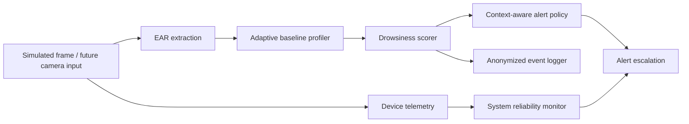

# ARM-Guard Architecture

Current implementation note: camera input is still simulated. The architecture is already separated so a live Arm64 landmark backend can replace the simulated provider without rewriting the privacy, scoring, alerting, or logging layers.
